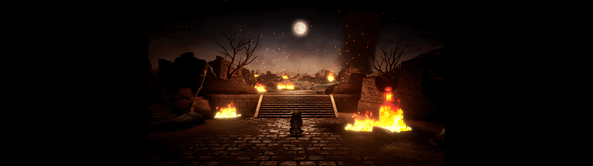

# FINAL FANTASY RESONANCE Fix


***This project is designed exclusively for Windows due to its reliance on Windows-specific APIs.***

## Fixes
- Remove black bars in ultrawide resolutions
- Movies are constrained to their original 16:9 format
- Add ability to constrain HUD

## Build and Install
Requires:
- [Rust](https://www.rust-lang.org/tools/install)
- [Python 3](https://www.python.org/downloads/)

1. Clone:
```ps1
git clone https://github.com/PolarWizard/final-fantasy-resonance-fix.git
cd final-fantasy-resonance-fix
```
2. Install [Ultimate ASI Loader](https://github.com/ThirteenAG/Ultimate-ASI-Loader) into the game folder (only needed once):
```ps1
python scripts/loader.py "<path to 'FINAL FANTASY RESONANCE\FFRS\Binaries\Win64' folder>"
```
3. Build and install the fix:
```ps1
python scripts/install.py "<path to 'FINAL FANTASY RESONANCE\FFRS\Binaries\Win64' folder>"
```
This builds a release DLL with `cargo` and copies it to `<game folder>/scripts/final_fantasy_resonance_fix.asi`, along with a default config on first install. Pass `--debug` to build and install a debug build instead.

If you're using VS Code, the same steps are wired up as tasks in `.vscode/tasks.json` (`loader`, `install`, `build and install`) -- edit the game folder path in there to match your install first.

## Configuration
- Edit `<game folder>/scripts/final_fantasy_resonance_fix.toml`

## Screenshots
|  |
| --- |
| <p align='center'> Fix disabled → Fix enabled </p> |

## License
Distributed under the MIT License. See [LICENSE](LICENSE) for more information. Third-party license text for every dependency can be generated with `python scripts/licenses.py`, which writes it out to `LICENSES`.

## Special Thanks
- Thank you [Dumper-7: Unreal Engine SDK Generator](https://github.com/Encryqed/Dumper-7) project for making this possible!
